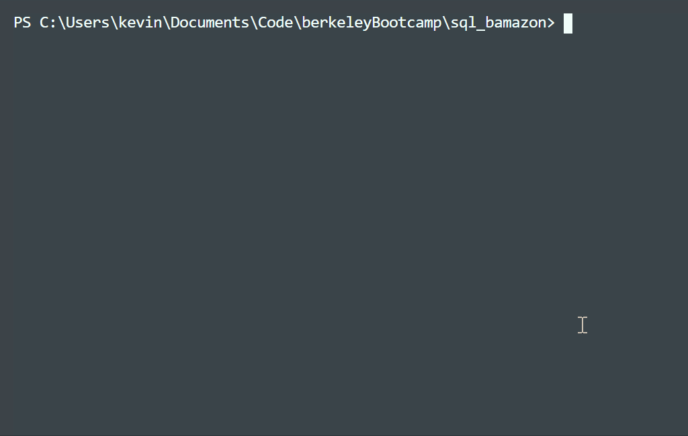
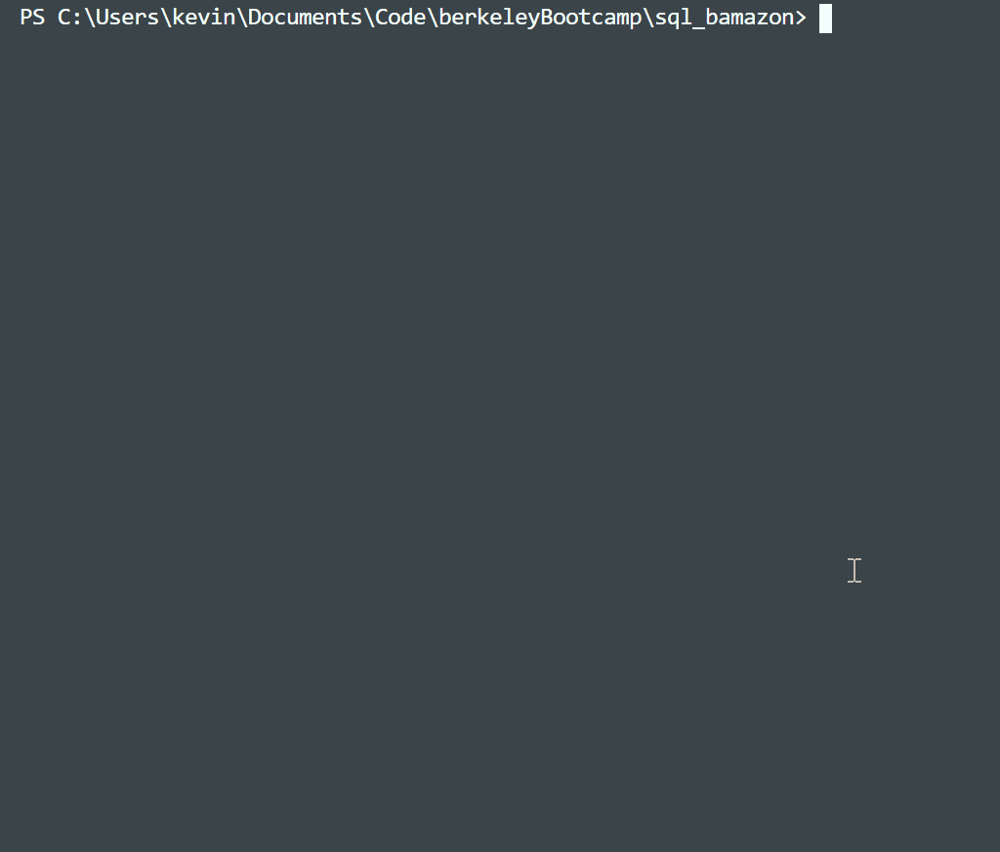

# Bamazon

Bamazon is a CLI app that uses Node and mySQL to model a basic online marketplace.  Two different user types are supported: customers can view and purchase from inventory, while managers can track low inventory and add new items to the inventory.

#### Manager

#### Customer

